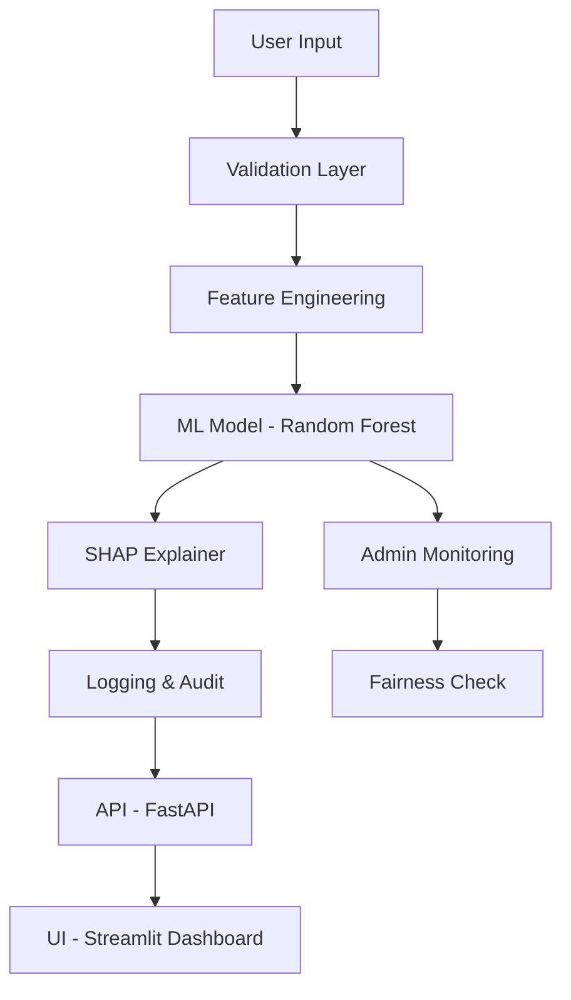

# Explainable Loan Approval ML System 🏦 🛡️

A production-grade, **Responsible AI** system that automates loan decisions while providing clear, transparent explanations. This project demonstrates high-impact ML Engineering and MLOps practices, focusing on **Explainability (SHAP)**, **Fairness Audit**, and **Proactive Monitoring**.

---

## 🌟 Key Features

- **XAI-Powered Approvals**: Uses **SHAP (SHapley Additive exPlanations)** to break down "Black Box" decisions into human-readable reasons.
- **Responsible AI Layer**: Integrated **Fairness Audits** to detect and mitigate bias in automated credit scoring.
- **Full-Stack ML Engineering**:
    - **FastAPI**: Backend service for programmatic loan assessment.
    - **Streamlit**: Dual-dashboard system for applicants and administrators.
- **Model Lifecycle (MLOps)**: Versioned model registry, automated performance tracking, and drift monitoring.
- **Feature Engineering**: Advanced transformation layer calculating **DTI (Debt-to-Income)** and **Stability Indices**.

---

## 🏗 System Architecture



---

## 🛠 Tech Stack

- **Core ML**: Scikit-Learn, XGBoost, SHAP
- **XAI & Fairness**: SHAP, Fairlearn
- **Data & Ops**: Pandas, Numpy, Joblib, Logging
- **Web**: FastAPI, Streamlit, Uvicorn
- **Containerization**: Docker

---

## 🚀 Getting Started

### 1. Installation & Training
```bash
pip install -r requirements.txt
python -m src.train
```

### 2. Launch Services
Start the Prediction API:
```bash
uvicorn api.app:app --port 8000
```

Start the User Dashboard:
```bash
streamlit run frontend/app.py --server.port 8501
```

Start the Admin Monitoring Dashboard:
```bash
streamlit run frontend/admin_dashboard.py --server.port 8502
```

---

## 📂 Project Structure

```bash
explainable-loan-approval/
├── api/             # FastAPI Backend
├── src/             # Core Logic
│   ├── validate.py      # Business Rules
│   ├── features.py      # Engineering Layer
│   ├── model_registry.py # Versioning
│   ├── fairness_check.py # Bias Audit
│   └── monitor.py       # Drift Simulation
├── frontend/        # Streamlit Dashboards
├── models/          # Versioned Artifacts (v1, v2)
└── logs/            # Audit & Prediction Logs
```

---

## 🤖 CI/CD & Production Notes
*This project is designed with a CI/CD mindset:*
- **Automated Retraining**: Can be triggered via GitHub Actions when data drift is detected in `src/monitor.py`.
- **Validation Gates**: Deployment requires passing the `fairness_check.py` parity ratio threshold.
- **Registry**: All models are tagged with semantic versioning and accompanied by performance JSONs.

---
*Created by **Anusha Goli** - Responsible AI Portfolio*
